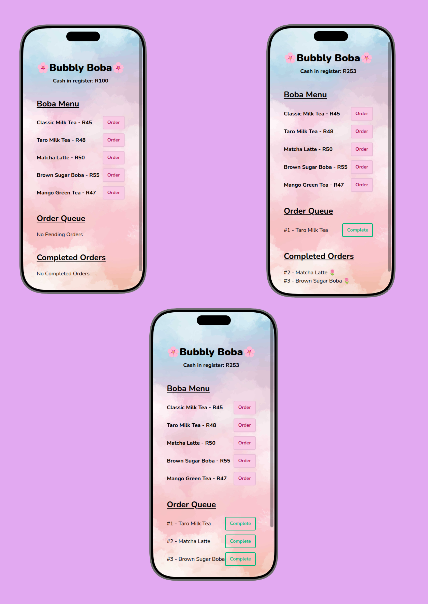

<p align="center">
  
</p>

This is a small, cute practice project I built to make sure I understand the basics of React and TypeScript.

The concept is simple: a customer walks into a boba shop, chooses a drink, and that drink gets added to an order queue. When the drink is ready, it’s marked as completed and moved to the completed list. At the same time, the cash in the register updates with each order.

It was a fun way to practise working with types, state, simple data flow, and UI structure without overcomplicating things.

---

## Screenshots

<p align="center">
    
</p>

---

## Live Demo

Live Site: https://your-link-here.com

---

## 🧋 What the app does

- Fetches a list of boba drinks from a local `boba.json` file (simulating an API call)
- Displays a boba menu inside a phone mock-up
- Allows users to place an order for a drink
- Adds the order to an **Order Queue** with a unique ID
- Marks orders as **Completed** via a button click
- Moves completed drinks into a **Completed Orders** section
- Updates the **cash in the register** in real time
- Uses TypeScript to strongly type all data (Boba + Orders)

<strong>It’s a learning project, not a production app, and that’s exactly the point.</strong>

---

## Tech stack

- **React** 
- **TypeScript**
- **Tailwind CSS**
- **DaisyUI** - for pre-built components like buttons and the phone mockup (it's built on top of Tailwind and provides ready-made, themeable components that speed up UI creation)
- **Vite**

---

## Want to challenge yourself? Try extending it

If you’d like to use this project for practice, here are some fun and beginner-friendly ideas:

1. **Swap the theme**
   - Change the background, colours, fonts, or images
   - Turn it into a coffee shop, smoothie bar, bakery, or burger stand

2. **Add Local Storage**
   - Save the orders, completed list, and cash in register
   - Restore the data on refresh

3. **Create a form to add new bobas**
   - Add input fields for name and price
   - Push new drinks into the menu dynamically

4. **Add a “Give Change” feature**
   - Add an input for how much the customer paid
   - Calculate the change
   - Subtract/change the register amount before adding the order

5. **Add a timer**
   - Automatically move orders from “Pending” to “Completed” after X seconds

6. **Add a Cancel/Delete button**
   - Remove an order and refund the amount

7. **Add filters**
   - Show only pending orders
   - Show only completed orders

Head's up. If you want to use this project as an example, to make your life easier, remove the 'data-theme="cupcake"' attr from the html tag in index.html. It's a theme from Daisy UI.

---

## Learning outcomes & reflections

Through this project, I’ve learned how to:

- Think in terms of data structures instead of just UI
- Use TypeScript to prevent bugs before they happen
- Structure a simple but complete React app

This project reminded me that small apps are powerful learning tools. You don’t need something complex to improve, just something that works and that you understand completely.

My biggest win from this: feeling more confident with TypeScript in a React environment!

---


## How to run the project

1. Install dependencies:

```bash
npm install
```

2. Start the dev server:

```bash
npm run dev
```

3. Make sure your boba.json is inside the public folder:

```bash
fetch('/boba.json')
```